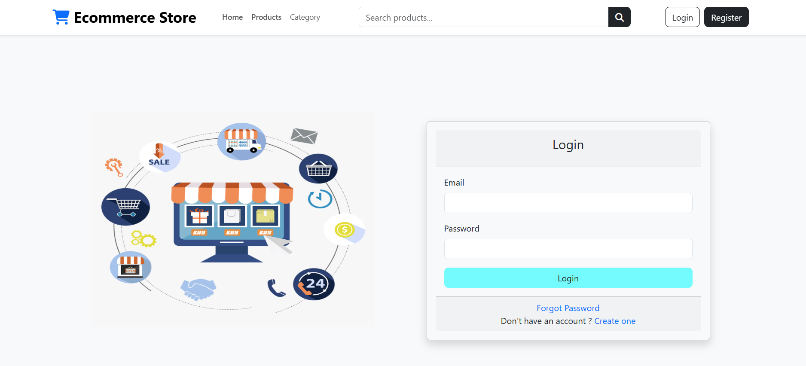
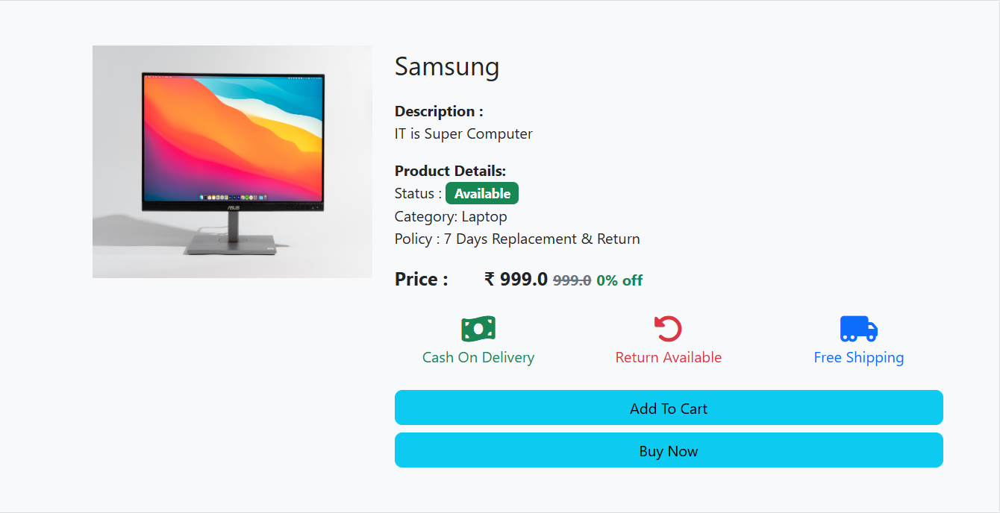
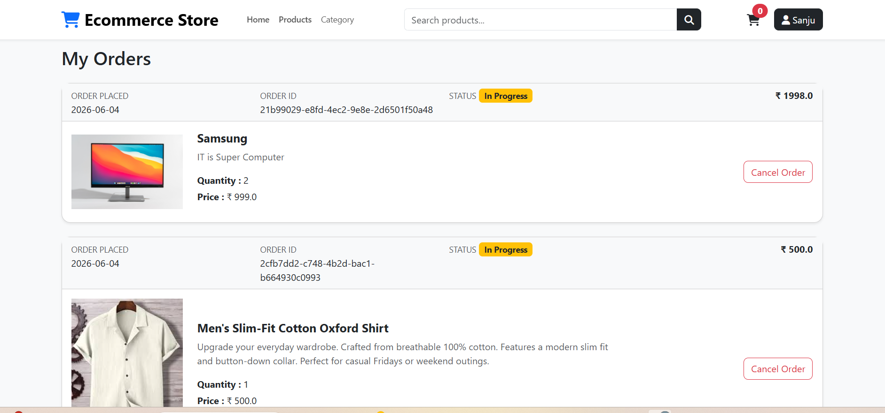
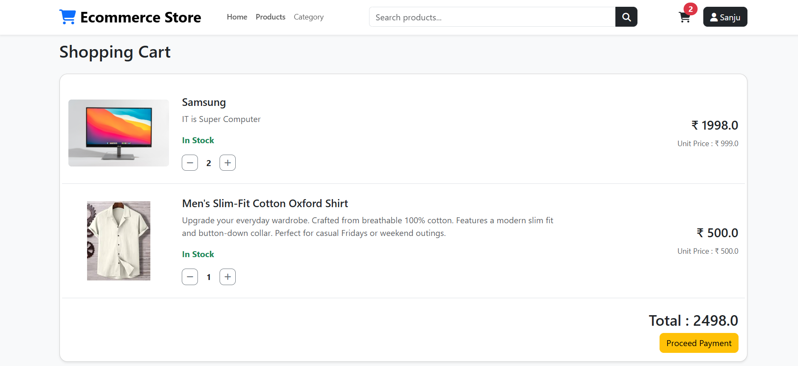
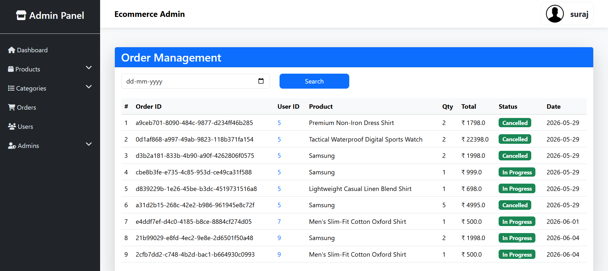
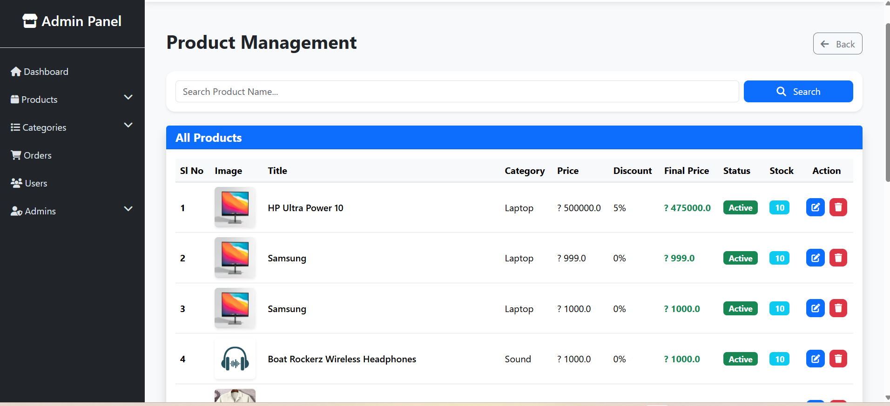
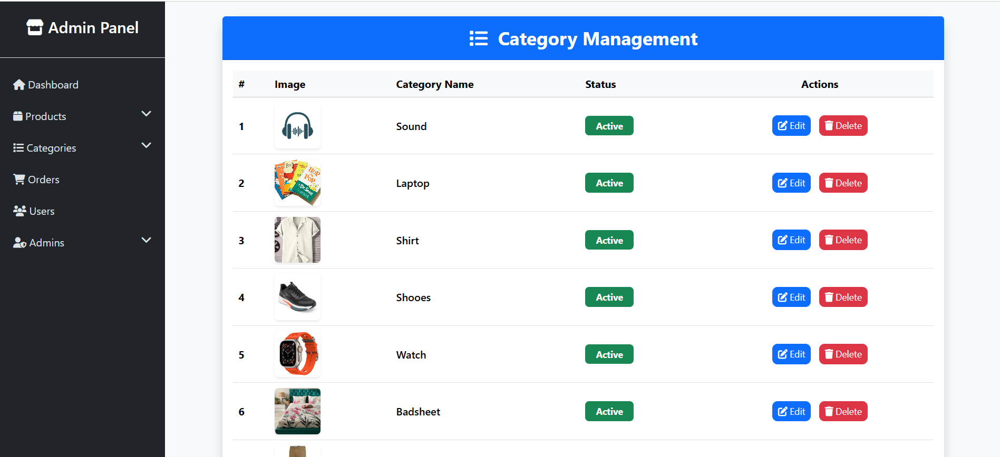

# E-Commerce Application

A full-stack E-Commerce web application developed using Spring Boot, Spring Security, Hibernate, MySQL, Thymeleaf, and Bootstrap. The application provides product management, category management, shopping cart functionality, order management, and role-based authentication for users and administrators.

---

## Features

### User Module

* User Registration and Login
* Secure Authentication using Spring Security
* Browse Products
* View Product Details
* Add Products to Cart
* Update Cart Quantity
* Remove Products from Cart
* Place Orders
* View Order History
* Manage User Profile

### Admin Module

* Admin Dashboard
* Category Management
* Product Management
* User Management
* Order Management
* Product Image Upload

---

## Tech Stack

### Backend

* Java 17
* Spring Boot
* Spring MVC
* Spring Security
* Spring Data JPA
* Hibernate

### Frontend

* Thymeleaf
* HTML
* CSS
* Bootstrap
* JavaScript

### Database

* MySQL

### Build Tool

* Maven

### Version Control

* Git
* GitHub

---

## Project Architecture

The project follows a layered architecture:

```text
Controller Layer
     ↓
Service Layer
     ↓
Repository Layer
     ↓
Database


---

## Database Setup

Create a MySQL database:

sql
CREATE DATABASE ecommerce_database;
```

Update the database configuration in:

```properties
src/main/resources/application.properties
```

```properties
spring.datasource.url=jdbc:mysql://localhost:3306/ecommerce_database
spring.datasource.username=YOUR_DB_USERNAME
spring.datasource.password=YOUR_DB_PASSWORD
```

---

## Installation & Run

### Clone Repository

```bash
git clone https://github.com/YOUR_GITHUB_USERNAME/ecommerce-springboot.git
```

### Navigate to Project

```bash
cd ecommerce-springboot
```

### Build Project

```bash
mvn clean install
```

### Run Application

```bash
mvn spring-boot:run
```

### Access Application

```text
http://localhost:8080
```

---

## Screenshots

### Home Page


### Login Page



### Product Details Page



### Order Details Page



### Shopping Cart



### Admin Dashboard



### Product Management



### Category Management



---

## Learning Outcomes

Through this project I gained hands-on experience with:

* Spring Boot Development
* Spring Security
* Hibernate & JPA
* MVC Architecture
* CRUD Operations
* Session Management
* Database Design
* Git & GitHub
* Layered Architecture
* Real-world Project Development

---

## Author

**Rohit Jadhav**

GitHub: https://github.com/Rohitjadhav36

---

## License

This project is developed for learning and portfolio purposes.
